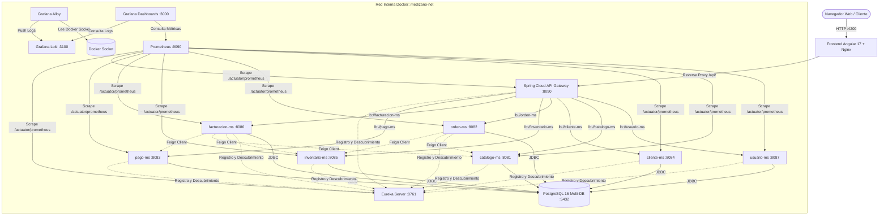

# MediZano POS - Arquitectura de Microservicios, Observabilidad y Despliegue Docker

Sistema empresarial integral de Punto de Venta (POS) y Gestión Farmacéutica construido bajo una arquitectura distribuida de microservicios nativa de la nube, contenerizada completamente con **Docker Compose**, descubrimiento dinámico mediante **Spring Cloud Netflix Eureka**, seguridad reactiva perimetral con **Spring Cloud Gateway** (JWT y RBAC), frontend contenerizado en **Angular 17** sobre **Nginx** con **Reverse Proxy**, y una suite profesional de **Observabilidad** compuesta por **Spring Boot Actuator**, **Micrometer**, **Prometheus**, **Loki**, **Grafana Alloy** y **Grafana**.

---

## 1. Arquitectura General del Sistema

### Diagrama de Bloques (ASCII)

```
                        ┌─────────────────────────────────────────┐
                        │     Frontend Angular 17 (Nginx)         │ (:4200)
                        │      Reverse Proxy: /api/ -> :8090      │
                        └────────────────────┬────────────────────┘
                                             │ HTTP / REST (Same-Origin)
                                             ▼
                        ┌─────────────────────────────────────────┐
                        │   Spring Cloud API Gateway (Perímetro)  │ (:8090)
                        │     (JWT Auth, RBAC & 503 Fallback)     │
                        └────────────────────┬────────────────────┘
                                             │ Red Interna Docker (medizano-net)
             ┌───────────────────────────────┼───────────────────────────────┐
             ▼                               ▼                               ▼
  ┌─────────────────────┐         ┌─────────────────────┐         ┌─────────────────────┐
  │     usuario-ms      │         │     catalogo-ms     │         │      orden-ms       │
  │   (:8087 interno)   │         │   (:8081 interno)   │         │   (:8082 interno)   │
  └──────────┬──────────┘         └──────────┬──────────┘         └──────────┬──────────┘
             ▼                               ▼                               ▼
  ┌─────────────────────┐         ┌─────────────────────┐         ┌─────────────────────┐
  │     cliente-ms      │         │    inventario-ms    │         │       pago-ms       │
  │   (:8084 interno)   │         │   (:8085 interno)   │         │   (:8083 interno)   │
  └──────────┬──────────┘         └──────────┬──────────┘         └──────────┬──────────┘
             ▼                               ▼
  ┌─────────────────────┐         ┌─────────────────────┐
  │   facturacion-ms    │         │  PostgreSQL Master  │ (:5432 interno)
  │   (:8086 interno)   │         │ (Multi-Schema POS)  │
  └──────────┬──────────┘         └─────────────────────┘
             │
             ├────────────────────────────────────────────────┐
             ▼                                                ▼
  ┌─────────────────────┐                          ┌─────────────────────┐
  │    Eureka Server    │ (:8761)                  │ Spring Boot Actuator│
  │  Service Discovery  │                          │    & Micrometer     │
  └─────────────────────┘                          └──────────┬──────────┘
                                                              │ Pull /actuator/prometheus
                                                              ▼
  ┌─────────────────────────────────────────┐      ┌─────────────────────┐
  │ Docker Engine Socket (/var/run/docker)  │      │     Prometheus      │ (:9090)
  └────────────────────┬────────────────────┘      └──────────┬──────────┘
                       │                                      │
                       ▼                                      │
  ┌─────────────────────────────────────────┐                 │
  │        Grafana Alloy (Collector)        │                 │
  └────────────────────┬────────────────────┘                 │
                       │ Push Logs                            │
                       ▼                                      │
  ┌─────────────────────────────────────────┐                 │
  │       Grafana Loki (Log Engine)         │ (:3100 interno) │
  └────────────────────┬────────────────────┘                 │
                       │                                      │
                       └──────────────────┬───────────────────┘
                                          ▼
                        ┌───────────────────────────────────┐
                        │     Grafana Analytics Platform    │ (:3000)
                        │ (Dashboards de Métricas y Logs)   │
                        └───────────────────────────────────┘
```

### Diagrama Mermaid



---

## 2. Inventario de Microservicios

| Microservicio | Puerto Interno | Base de Datos | Stack Tecnológico | Responsabilidad |
|---|:---:|---|---|---|
| **api-gateway** | `8090` | N/A | Spring Cloud Gateway, Reactive, JWT, Micrometer | Perímetro de seguridad, validación JWT, RBAC, enrutamiento dinámico y respuesta estructurada 503 ante fallos. |
| **eureka-server** | `8761` | N/A | Spring Cloud Netflix Eureka Server | Registro de instancias y resolución de nombres dinámica (`lb://<service-name>`). |
| **usuario-ms** | `8087` | `medizano_usuarios_db` | Spring Boot 3, Spring Security, JWT, JPA, Flyway/Ddl | Autenticación, generación y validación de tokens JWT, gestión de usuarios y auditoría de accesos. |
| **catalogo-ms** | `8081` | `medizano_catalogo_db` | Spring Boot 3, Spring Data JPA, Hibernate | Catálogo de productos, medicamentos, fabricantes, control de prescripción y búsqueda por código de barras. |
| **cliente-ms** | `8084` | `medizano_clientes_db` | Spring Boot 3, Spring Data JPA, Hibernate | Directorio y fidelización de clientes para facturación y ventas POS. |
| **inventario-ms** | `8085` | `medizano_inventario_db` | Spring Boot 3, Spring Data JPA, Hibernate | Gestión de lotes farmacéuticos, fechas de caducidad, stock disponible y alertas de bajo inventario. |
| **orden-ms** | `8082` | `medizano_ordenes_db` | Spring Boot 3, Spring Data JPA, OpenFeign | Órdenes de compra transaccionales y reservas de stock. |
| **facturacion-ms** | `8086` | `medizano_facturacion_db` | Spring Boot 3, Spring Data JPA, OpenFeign | Generación de comprobantes de venta (boletas/facturas), cálculo de impuestos (IGV/GST), devoluciones y reportes analíticos. |
| **pago-ms** | `8083` | `medizano_pagos_db` | Spring Boot 3, Spring Data JPA, HTTP Client | Procesamiento de cobros multimoneda, integración con PayPal Sandbox y Mercado Pago Checkout Pro / Webhooks. |
| **frontend** | `80` *(expuesto :4200)* | N/A | Angular 17, TypeScript, Bootstrap 5, Nginx Alpine | Interfaz web de usuario (POS, Gestión de Medicamentos, Facturación, Devoluciones y Reportes). |

---

## 3. Frontend Angular 17 Contenerizado con Nginx Reverse Proxy

### 3.1. Arquitectura de Despliegue del Frontend
El frontend se ejecuta en un contenedor Nginx Alpine ultraligero que cumple dos funciones clave:
1. **Servidor Web de Contenido Estático**: Entrega los artefactos compilados de la Single Page Application (SPA) de Angular 17 con compresión y caché optimizada.
2. **Reverse Proxy hacia el API Gateway**: Nginx intercepta todas las solicitudes hacia `/api/` y las reenvía internamente por la red Docker a `http://api-gateway:8090/api/`.

### 3.2. Configuración de Nginx (`frontend/nginx.conf`)
```nginx
server {
    listen 80;
    listen [::]:80;
    server_name localhost;

    location / {
        root /usr/share/nginx/html;
        index index.html index.htm;
        try_files $uri $uri/ /index.html;
    }

    # Proxy inverso para microservicios a través del API Gateway
    location /api/ {
        proxy_pass http://api-gateway:8090/api/;
        proxy_http_version 1.1;
        proxy_set_header Host $host;
        proxy_set_header X-Real-IP $remote_addr;
        proxy_set_header X-Forwarded-For $proxy_add_x_forwarded_for;
        proxy_set_header X-Forwarded-Proto $scheme;
    }

    location ~* \.(?:ico|css|js|gif|jpe?g|png|woff2?|eot|ttf|svg)$ {
        root /usr/share/nginx/html;
        expires 1y;
        add_header Cache-Control "public, max-age=31536000, immutable";
    }

    error_page 500 502 503 504 /50x.html;
    location = /50x.html {
        root /usr/share/nginx/html;
    }
}
```

### 3.3. Configuración de Angular (`environment.prod.ts` y `environment.ts`)
```typescript
export const environment = {
  production: true,
  apiUrl: '/api'
};
```

### 3.4. Ventajas Fundamentales de Esta Arquitectura
- **Eliminación Absoluta de Problemas CORS**: Como el navegador solicita `http://localhost:4200/api/...`, la petición es **Same-Origin** con respecto a la aplicación cargada (`http://localhost:4200/`).
- **Independencia de Host y Portabilidad Total**: No existen URLs absolutas tipo `http://localhost:8090` hardcodeadas en el código compilado. Al desplegar MediZano en un servidor con IP estática o dominio (`http://192.168.1.100:4200` o `https://pos.medizano.com`), la aplicación funciona de inmediato sin necesidad de recompilar.
- **Seguridad en Red Privada**: Los microservicios no requieren exponer puertos adicionales al host del usuario.

---

## 4. Diagnóstico y Resolución del Error de Conexión en Frontend

### Causa Raíz Identificada
Al abrir `http://localhost:4200`, el frontend presentaba el mensaje:
> *"No se pudo conectar con el servidor. Verifica que el backend esté encendido."*

Tras la auditoría técnica profunda, se identificaron **dos causas reales concurrentes**:
1. **Conflicto de Cabeceras CORS Duplicadas**: Tanto el `api-gateway` (vía `spring.cloud.gateway.globalcors`) como `usuario-ms` (vía `SecurityConfig.java`) agregaban cabeceras `Access-Control-Allow-Origin: http://localhost:4200`. La especificación W3C/Fetch prohíbe múltiples valores para dicha cabecera. Los navegadores modernos (Chrome, Edge, Firefox) abortan la solicitud por política CORS estricta y retornan código `status: 0` al cliente HTTP de Angular.
2. **Ausencia de Reverse Proxy en el Contenedor Nginx**: Nginx no contaba con una regla `location /api/`, por lo que cualquier petición POST interna al puerto 4200 recibía `HTTP 405 Method Not Allowed`.

### Solución Definitiva Implementada
1. **Nginx Reverse Proxy Configurado**: Nginx ahora enruta `/api/` a `api-gateway:8090/api/`.
2. **Deduplicación Automática en Gateway**: Se activó el filtro `DedupeResponseHeader=Access-Control-Allow-Origin Access-Control-Allow-Credentials, RETAIN_UNIQUE` en Spring Cloud Gateway, previniendo cabeceras duplicadas.
3. **Mapeo Robusto de Errores en Angular (`api.service.ts`)**:
   - `0`: "No se pudo establecer conexión con el servidor (ERR_CONNECTION_REFUSED / Red). Verifica que los servicios estén activos."
   - `400`: "Solicitud incorrecta. Revisa los datos enviados."
   - `401`: "Usuario o contraseña incorrectos o sesión expirada."
   - `403`: "Acceso denegado: No cuentas con los permisos necesarios para realizar esta acción."
   - `404`: "El recurso solicitado no fue encontrado en el servidor."
   - `500`: "Error interno en el servidor. Por favor intenta más tarde."
   - `503`: "Servicio no disponible: El microservicio correspondiente se encuentra reiniciando o inaccesible."

---

## 5. Aislamiento de Red y Cierre de Puertos al Host (Zero-Trust)

### ¿Por qué los puertos 8081 a 8087 NO están vinculados al Host?
En arquitecturas vulnerables, vincular microservicios al host (`0.0.0.0:808x->808x`) permite a cualquier usuario evadir el API Gateway y consumir directamente la lógica interna sin autenticación JWT ni control de roles.

### Política de Red Implementada en Docker Compose
- **Único Puerto Público de Entrada Web**: `:4200` (Frontend Nginx) y opcionalmente `:8090` (API Gateway directo).
- **Puertos 8081 a 8087 (Microservicios)**: Configurados con `expose:` en lugar de `ports:`. Solo accesibles dentro del puente Docker `medizano-net`.
- **PostgreSQL (`:5432`) y Loki (`:3100`)**: Completamente internos a Docker.

---

## 6. Seguridad y Autenticación JWT + Control de Acceso (RBAC)

### Flujo de Autenticación
1. El cliente envía `POST /api/auth/login` con `{ username, password }`.
2. `usuario-ms` valida las credenciales encriptadas con BCrypt y genera un token JWT firmado con algoritmo HMAC-SHA256 (384-bit key).
3. El frontend almacena el token en `localStorage` y lo adjunta automáticamente en cada petición mediante `TokenInterceptor` (`Authorization: Bearer <token>`).
4. `api-gateway` y los microservicios downstream validan la firma, vigencia y roles del token en cada solicitud.

### Matriz de Roles y Permisos

| Rol | Rutas Autorizadas | Funcionalidad |
|---|---|---|
| `ADMIN` | `/api/admin/**`, `/api/pharmacist/**`, `/api/cashier/**`, `/api/v1/**` | Acceso irrestricto a usuarios, auditoría, catálogo, inventario, ventas y reportes. |
| `CASHIER` | `/api/cashier/bills/**`, `/api/cashier/returns/**`, `/api/cashier/paypal/**`, `/api/cashier/mercadopago/**` | Emisión de boletas/facturas, cobros y devoluciones de clientes. |
| `STOCK_MONITOR` | `/api/pharmacist/medicines/**`, `/api/pharmacist/batches/**`, `/api/v1/inventario/**` | Supervisión de stock, control de lotes y alertas de caducidad. |
| `STOCK_KEEPER` | `/api/pharmacist/medicines/**`, `/api/pharmacist/batches/**` | Registro de nuevos medicamentos y actualización de existencias. |
| `CUSTOMER_SUPPORT`| `/api/cashier/returns/**` | Gestión y validación de devoluciones de productos. |
| `ANALYST` / `MANAGER` | `/api/admin/reports/**`, `/api/v1/ordenes/**` | Consulta de reportes de ventas, recaudación y transacciones. |

---

## 7. Tolerancia a Fallos y Manejo de Caídas (HTTP 503)

El API Gateway cuenta con `GlobalGatewayExceptionHandler` (`@Order(-1)`). Si un microservicio individual (por ejemplo `catalogo-ms`) se detiene o se desconecta de Eureka:
1. El Gateway intercepta la excepción reactiva de conexión (`ConnectException`, `ResponseStatusException`).
2. Devuelve de inmediato una respuesta estructurada **`HTTP 503 Service Unavailable`**:
   ```json
   {
     "timestamp": "2026-09-03T23:11:45.840Z",
     "status": 503,
     "error": "Service Unavailable",
     "service": "catalogo-ms",
     "path": "/api/pharmacist/medicines",
     "message": "El microservicio solicitado se encuentra temporalmente no disponible"
   }
   ```
3. El frontend muestra al usuario un mensaje claro sin romper la aplicación.
4. Prometheus registra la caída (`up == 0`) y Grafana dispara las alertas correspondientes.

---

## 8. Suite de Observabilidad: Prometheus, Loki, Alloy y Grafana

### 8.1. Métricas con Prometheus y Micrometer
Cada microservicio Spring Boot expone `/actuator/prometheus`. Prometheus (`:9090`) recolecta periódicamente:
- **Tasa de Peticiones HTTP**: `rate(http_server_requests_seconds_count[1m])`
- **Tiempos de Respuesta (Percentiles)**: `histogram_quantile(0.95, sum(rate(http_server_requests_seconds_bucket[5m])) by (le))`
- **Memoria Heap JVM**: `jvm_memory_used_bytes{area="heap"}`
- **Hilos Activos**: `jvm_threads_live_threads`
- **Uso de CPU**: `process_cpu_usage`

### 8.2. Logs Centralizados con Grafana Alloy y Loki
- **Grafana Alloy (`v1.1.0`)**: Recolector oficial OpenTelemetry de Grafana Labs que reemplaza a Promtail. Lee los logs directamente del socket de Docker (`/var/run/docker.sock`), extrae metadatos del contenedor y los despacha a Loki (`:3100`).
- **Consultas LogQL Útiles en Grafana**:
  ```logql
  # Ver errores en el API Gateway
  {service="api-gateway"} |= "ERROR"
  
  # Rastrear ventas emitidas en Facturación
  {service="facturacion-ms"} |= "Venta registrada"
  
  # Supervisar accesos y login en Usuario-MS
  {service="usuario-ms"} |= "Inicio de sesión"
  ```

### 8.3. Dashboards Auto-Aprovisionados en Grafana
Grafana (`:3000`) se inicializa automáticamente con:
- Datasource Prometheus (`http://prometheus:9090`)
- Datasource Loki (`http://loki:3100`)
- Dashboard de Visión General MediZano (`/d/medizano-observability-overview`)

---

## 9. Healthchecks Estrictos de Docker (Sin `exit 0` Falsos)

Todos los contenedores en `docker-compose.yml` implementan healthchecks reales que validan el estado activo del servicio (`status: UP`):

```yaml
healthcheck:
  test: ["CMD-SHELL", "wget -q -O - http://localhost:8087/actuator/health | grep -q 'UP' || exit 1"]
  interval: 10s
  timeout: 5s
  retries: 3
  start_period: 25s
```

| Contenedor | Comando de Verificación | Condición Saludable |
|---|---|---|
| `medizano-frontend` | `wget -q -O - http://127.0.0.1/ \|\| exit 1` | Retorna HTML 200 |
| `medizano-api-gateway` | `wget -q -O - http://localhost:8090/actuator/health \| grep -q 'UP' \|\| exit 1` | Retorna `{"status":"UP"}` |
| `medizano-eureka-server` | `wget -q -O - http://localhost:8761/actuator/health \| grep -q 'UP' \|\| exit 1` | Retorna `{"status":"UP"}` |
| `medizano-usuario-ms` | `wget -q -O - http://localhost:8087/actuator/health \| grep -q 'UP' \|\| exit 1` | Retorna `{"status":"UP"}` |
| `medizano-catalogo-ms` | `wget -q -O - http://localhost:8081/actuator/health \| grep -q 'UP' \|\| exit 1` | Retorna `{"status":"UP"}` |
| `medizano-cliente-ms` | `wget -q -O - http://localhost:8084/actuator/health \| grep -q 'UP' \|\| exit 1` | Retorna `{"status":"UP"}` |
| `medizano-orden-ms` | `wget -q -O - http://localhost:8082/actuator/health \| grep -q 'UP' \|\| exit 1` | Retorna `{"status":"UP"}` |
| `medizano-inventario-ms`| `wget -q -O - http://localhost:8085/actuator/health \| grep -q 'UP' \|\| exit 1` | Retorna `{"status":"UP"}` |
| `medizano-pago-ms` | `wget -q -O - http://localhost:8083/actuator/health \| grep -q 'UP' \|\| exit 1` | Retorna `{"status":"UP"}` |
| `medizano-facturacion-ms`| `wget -q -O - http://localhost:8086/actuator/health \| grep -q 'UP' \|\| exit 1` | Retorna `{"status":"UP"}` |
| `medizano-postgres` | `pg_isready -U postgres` | Postgres listo para conexiones |
| `medizano-prometheus` | `wget -q -O - http://localhost:9090/-/healthy \| grep -q 'Prometheus Server is Healthy.' \|\| exit 1` | Prometheus listo |
| `medizano-loki` | `wget -q -O - http://localhost:3100/ready \| grep -q 'ready' \|\| exit 1` | Loki listo |
| `medizano-grafana` | `wget -q -O - http://localhost:3000/api/health \| grep -q 'ok' \|\| exit 1` | Grafana listo |

---

## 10. Mapeo de Puertos del Ecosistema

| Servicio | Puerto Host | Puerto Contenedor | Tipo de Acceso |
|---|:---:|:---:|---|
| **medizano-frontend** | **4200** | 80 | Público (Navegador Web) |
| **medizano-api-gateway** | **8090** | 8090 | Público (REST API) |
| **medizano-eureka-server** | **8761** | 8761 | Administrativo (Discovery Dashboard) |
| **medizano-prometheus** | **9090** | 9090 | Administrativo (Métricas y PromQL) |
| **medizano-grafana** | **3000** | 3000 | Administrativo (Dashboards y Logs) |
| **medizano-usuario-ms** | *(Sin vincular)* | 8087 | Red Interna Docker (`medizano-net`) |
| **medizano-catalogo-ms** | *(Sin vincular)* | 8081 | Red Interna Docker (`medizano-net`) |
| **medizano-cliente-ms** | *(Sin vincular)* | 8084 | Red Interna Docker (`medizano-net`) |
| **medizano-orden-ms** | *(Sin vincular)* | 8082 | Red Interna Docker (`medizano-net`) |
| **medizano-inventario-ms** | *(Sin vincular)* | 8085 | Red Interna Docker (`medizano-net`) |
| **medizano-pago-ms** | *(Sin vincular)* | 8083 | Red Interna Docker (`medizano-net`) |
| **medizano-facturacion-ms**| *(Sin vincular)* | 8086 | Red Interna Docker (`medizano-net`) |
| **medizano-postgres** | *(Sin vincular)* | 5432 | Red Interna Docker (`medizano-net`) |
| **medizano-loki** | *(Sin vincular)* | 3100 | Red Interna Docker (`medizano-net`) |
| **medizano-alloy** | *(Sin vincular)* | *(Socket)* | Red Interna Docker (`medizano-net`) |

---

## 11. Variables de Entorno y Secretos (`.env.example`)

Cree un archivo `.env` en la raíz del proyecto para sobreescribir las credenciales por defecto:

```ini
# --- Base de Datos PostgreSQL ---
POSTGRES_DB=medizano_master_db
POSTGRES_USER=postgres
POSTGRES_PASSWORD=your_secure_postgres_password_here

# --- Seguridad y Autenticación JWT ---
JWT_SECRET=YourSuperSecretKeyForJWTTokensMustBeAtLeast256BitsLong2026
MEDIZANO_DEFAULT_PASSWORD=admin123

# --- Pasarela PayPal Sandbox ---
PAYPAL_BASE_URL=https://api-m.sandbox.paypal.com
PAYPAL_CLIENT_ID=your_paypal_sandbox_client_id_here
PAYPAL_CLIENT_SECRET=your_paypal_sandbox_client_secret_here
PAYPAL_CURRENCY=USD
PAYPAL_EXCHANGE_RATE=3.75

# --- Pasarela Mercado Pago ---
MERCADOPAGO_ACCESS_TOKEN=TEST-your-mercadopago-access-token-here
MERCADOPAGO_PUBLIC_KEY=TEST-your-mercadopago-public-key-here
MERCADOPAGO_BASE_URL=https://api.mercadopago.com
MERCADOPAGO_CURRENCY=PEN
MERCADOPAGO_WEBHOOK_SECRET=your_mp_webhook_secret_key_here

# --- Suite de Observabilidad: Grafana ---
GRAFANA_ADMIN_USER=admin
GRAFANA_ADMIN_PASSWORD=your_grafana_secure_admin_password_here
```

---

## 12. Guía de Despliegue Rápido

### Requisitos Previos
- Docker Engine 24+ y Docker Compose v2+
- Git

### 12.1. Clonar y Levantar Todo (15 Contenedores)
```bash
git clone https://github.com/rbn-69-cod/MediZano_microservicios.git
cd MediZano_microservicios

# Levantar toda la infraestructura contenerizada
docker compose up -d --build
```
> **Nota de Producción**: No se requiere instalar Node.js, Java ni Maven en la máquina anfitriona. Todo el proceso de empaquetado y ejecución corre en contenedores Docker aislados.

### 12.2. Verificar Salud de los Servicios
```bash
docker compose ps
```
Debe visualizar los 15 contenedores en estado `Up (healthy)`.

### 12.3. Acceder a las Aplicaciones
- **Frontend POS MediZano**: [http://localhost:4200](http://localhost:4200)
- **API Gateway REST**: [http://localhost:8090](http://localhost:8090)
- **Eureka Service Registry**: [http://localhost:8761](http://localhost:8761)
- **Prometheus Metrics**: [http://localhost:9090](http://localhost:9090)
- **Grafana Analytics**: [http://localhost:3000](http://localhost:3000)

### 12.4. Detener el Ecosistema
```bash
docker compose down
```

---

## 13. Usuarios y Credenciales por Defecto

### Usuarios de la Aplicación (Base de Datos)
| Usuario | Contraseña | Rol | Permisos Principales |
|---|---|---|---|
| `admin` | `admin123` | `ADMIN` | Administración total del sistema, reportes, usuarios y auditoría. |
| `cajero` | `admin123` | `CASHIER` | Módulo de Punto de Venta (Billing), cobranzas y devoluciones. |
| `inventario` | `admin123` | `STOCK_MONITOR`| Módulo de Catálogo de Medicamentos y Lotes de Inventario. |

### Credenciales de Grafana
- **URL**: [http://localhost:3000](http://localhost:3000)
- **Usuario**: `admin` (o el especificado en `GRAFANA_ADMIN_USER`)
- **Contraseña**: `admin123` (o el especificado en `GRAFANA_ADMIN_PASSWORD`)

---

## 14. Guía de Solución de Problemas (Troubleshooting)

### 1. El frontend muestra "No se pudo establecer conexión con el servidor"
- **Causa**: El contenedor `medizano-api-gateway` o `medizano-frontend` no está levantado.
- **Solución**: Ejecute `docker compose ps` y verifique que `medizano-api-gateway` reporte `(healthy)`. Si está reiniciando, inspeccione los logs con `docker logs medizano-api-gateway`.

### 2. Respuesta HTTP 503 Service Unavailable al consultar medicamentos o ventas
- **Causa**: El microservicio correspondiente (`catalogo-ms`, `facturacion-ms`, etc.) no ha completado su registro en Eureka Server o se cayó.
- **Solución**: Abra [http://localhost:8761](http://localhost:8761) y confirme que el microservicio figure registrado en **Instances currently registered with Eureka**. Si no está, reinícielo con `docker compose restart <nombre-microservicio>`.

### 3. Error 401 Unauthorized al consultar endpoints protegidos
- **Causa**: No se envió la cabecera `Authorization: Bearer <token>` o el token JWT expiró.
- **Solución**: Realice el inicio de sesión en `/api/auth/login` para obtener un nuevo token e inclúyalo en las solicitudes subsiguientes.

### 4. Reiniciar un microservicio individual sin detener el resto del sistema
```bash
docker compose restart catalogo-ms
```

### 5. Inspeccionar logs en vivo de un microservicio específico
```bash
docker compose logs -f usuario-ms
```
